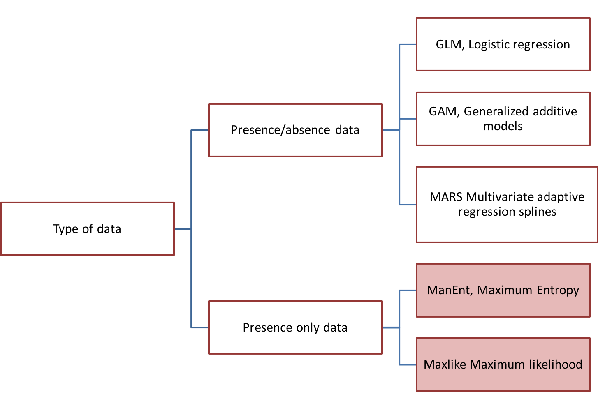

```{r global_options, eval=T, echo=F,results='hide', error=F, warning=FALSE, message=FALSE}

knitr::opts_chunk$set(fig.width=6, fig.height=4, fig.path='Figs/',  eval=T, echo=T, warning=FALSE, message=FALSE, results='hide')
rm(list=ls())
library(sp)
library(maptools)
library(spatstat)
library(dismo)

```

# Statistical perspective of species distribution modeling

## Poisson process

- Homogeneous Poisson process with intensity $\lambda$ have two properties:
    - $N(A)$ is Poisson distributed with mean $\lambda|A|$, for all $A$
    - Condition on $N(A)$, the $n$ points are independent and uniformly
      distributed in $A$
      
- model for complete spatial randomness and null model in a statistical
  analysis.
  
## Non-Poisson Process

- Poisson cluster processes
     - Hierarchical processes: Parent Poisson processes with offspring point
       processes
     - Example, Matern cluster process, each parent has Poisson($\mu$) number of
       offsprings uniformly distributed around the parent.
     
- Cox processes
      - A Poisson process with a random intensity function 
      - Example, log-Gaussian Cox processes (LGCP) in which intensity
        $\lambda(u)$ is a Gaussian random field.

```{r ppp}

# Materm cluster proccess
cluster <- rMatClust(90, 0.05, 10)
plot(cluster)

# log-Gaussian Cox procces

lgcp <-  rLGCP("exp", 3, var=0.2, scale=.1 )
plot(lgcp)

# inhomogeneous LGCP with Gaussian covariance function
m <- as.im(function(x, y){5 - 1.5 * (x - 0.5)^2 + 2 * (y - 0.5)^2}, W=owin())
plot(m)
X <- rLGCP("gauss", m, var=0.15, scale =0.5)
plot(attr(X, "Lambda"))
points(X)

```

# Species distribution modeling

Species distribution models (SDMs) estimate the relationship between species
records at sites and the environmental and/or spatial characteristics of those
sites. See Figure \ref{fig.sdm} for commonly used SDM methods.


{width=10cm}

## Absence and background data

- Background data are not attempting to guess at absence locations, but rather to
characterize environments in the study region.

- Background data establishes the environmental domain of the study or regions
where a specie should habitat but hasn't, whilst presence data should establish
under which conditions a species is more likely to be present than on average.

- A closely related concept is "pseudo-absences", which is also used for
generating the non-presence class. In this case, researchers try to guess where
absences might occur they may sample the whole region except at presence
locations, or they might sample at places unlikely to be suitable for the
species.


```{r sdm1}

# Random background data

files <- list.files(path=paste(system.file(package="dismo"), '/ex' , sep= ''), pattern= 'grd', full.names=TRUE )

mask <- raster(files[1])
set.seed(1963)
bg <- randomPoints(mask, 500 )

# set up the plotting area for two maps

par(mfrow=c(1,2))
plot(!is.na(mask), legend=FALSE)
points(bg, cex=0.5)
# now we repeat the sampling, but limit
# the area of sampling using a spatial extent
e <- extent(-80, -53, -39, -22)
bg2 <- randomPoints(mask, 50, ext=e)
plot(!is.na(mask), legend=FALSE)
plot(e, add=TRUE, col= ' red ')
points(bg2, cex=0.5)

```

```{r pseudo-absense}

# Pseudo-abasense

file <- paste(system.file(package="dismo"), '/ex/acaule.csv' , sep='')
ac <- read.csv(file)
coordinates(ac) <- ~lon+lat
projection(ac)<-CRS('+proj=longlat +datum=WGS84')

data(wrld_simpl)
plot(mask)
points(ac)
plot(wrld_simpl, add=TRUE, border='dark grey')

# Generate a cicule centered at each acaule
x <- circles(ac, d=50000, lonlat=TRUE)
pol <- polygons(x)

# Now sample 250 random 'pseudo' location around each acaule sample locations
samp1 <- spsample(pol, 250, type= 'random' , iter=25)
points(samp1)


```

## Regression models

- Converting a SDM problem into a generalized linear regression (GLM) or generalized additive models (GAM)

$$\eta(s)= \alpha+\sum_{p=1}^{P}\beta_iX_i(s)+\epsilon(s)$$
where $\eta(\cdot)=\frac{P(s)}{1-P(s)}$ is the logit link function, $X_i$ is the $i-$th variable and $\epsilon(\cdot)\sim N(\mu, \sigma)$ is Gaussian distributed residuals. 

- The diagnostic tools (e.g., AIC, k-fold methods) avaiable in GLM can be applied to here


## How good are the models

- Confusion matrix

|    |     +         |         -      |
|:---|:--------------|:---------------|
| +  | True Positive | Faluse Positive|
| -  | False Positive| True Negative  |

- Kappa statistics: Scales between 0 and 1; >0.7 good, 0.4 – 0.7 fair, <0.4 poor

- ROC curves and AUC: 0.8 good, 0.6 – 0.8 fair, 0.5 random, <0.6 poor

{width=200}


```{r regression}

# Regression models

# sample locations
file <- paste(system.file(package="dismo"), "/ex/bradypus.csv", sep="")
bradypus <- read.table(file,  header=TRUE,  sep= ',')
bradypus  <- bradypus[,-1]

# environment conditions

files <- list.files(path=paste(system.file(package="dismo"), '/ex', sep= ''), pattern= 'grd' , full.names=TRUE )
predictors <- stack(files)

# first layer of the RasterStack
plot(predictors, 1)
#plot(predictors)
# note the "add=TRUE" argument with plot
plot(wrld_simpl, add=TRUE)
# with the points function, "add" is implicit
points(bradypus, col= ' blue ')


# 'biome' is a categorical data that needs special treatment in
# regression case, let's simply drop it from the predicator stacks.

pred_nf <- dropLayer(predictors, 'biome')

# Generate background data. To speed up processing, let's restrict the
# predictions to a more restricted area:

ext = extent(-90, -32, -33, 23)
backg <- randomPoints(pred_nf, n=1000, ext=ext)
colnames(backg) = c('lon', 'lat')
backg=as.data.frame(backg)

# Randomly seperate the bradypus observations into 5 groups and use
# four of them as training data and the rest one for validation

group <- kfold(bradypus, 5)
pres_train <- bradypus[group != 1, ]
pres_test <- bradypus[group == 1, ]

group <- kfold(backg, 5)
backg_train <- backg[group != 1, ]
backg_test <- backg[group == 1, ]

# Display the training and validation test data
r = raster(pred_nf, 1)
plot(!is.na(r), col=c(' white ' , ' light grey '), legend=FALSE)
plot(ext, add=TRUE, col= ' red ' , lwd=2)
points(backg_train$lon, backg_train$lat,  col= ' yellow ')
points(backg_test$lon, backg_test$lat,  col= ' red ')
points(pres_train$lon, pres_train$lat, pch= '+' , col= ' green ')
points(pres_test$lon, pres_test$lat, pch= '+' , col= 'blue')


# Combine sample locations and environment conditions into one data frame
train <- rbind(pres_train, backg_train)
pb_train <- c(rep(1, nrow(pres_train)), rep(0, nrow(backg_train)))
envtrain <- extract(predictors, train)
envtrain <- data.frame( cbind(pa=pb_train, envtrain) )
envtrain[,'biome'] = factor(envtrain[,'biome'], levels=1:14)
head(envtrain)

testpres <- data.frame( extract(predictors, pres_test) )
testbackg <- data.frame( extract(predictors, backg_test) )
testpres[ ,'biome'] = factor(testpres[ ,'biome'], levels=1:14)
testbackg[ ,'biome'] = factor(testbackg[ ,'biome'], levels=1:14)

#In R , GLM is implemented in the 'glm' function, and the link function and
#error distribution are specified with the 'family' argument. Examples are:
#family = binomial(link = "logit")
#family = gaussian(link = "identity")
#family = poisson(link = "log")

# logistic regression:
gm1 <- glm(pa ~ bio1 + bio5 + bio6 + bio7 + bio8 + bio12 + bio16 + bio17,
family = binomial(link = "logit"), data=envtrain)
summary(gm1)

gm2 <- glm(pa ~ bio1+bio5 + bio6 + bio7 + bio8 + bio12 + bio16 + bio17,
family = gaussian(link = "identity"), data=envtrain)

# Model evaluation

# ROC curve (reveiver operating characterstic curve) and related AUC
# (area under the curve) are commonly used metrics for classification
# performance. The ROC curve is based on confusion matrix.  X is false
# positive rate (FP/(FP+TN))and Y is true positive rate (TP/(TP+FN)).
# Applying these two rate to different sets of classification
# threshold leads to the ROC curve

ge1=evaluate(testpres, testbackg, gm1)
ge2=evaluate(testpres, testbackg, gm2)

pg <- predict(predictors, gm2, ext=ext)
par(mfrow=c(1,2))
plot(pg, main='GLM/gaussian, raw values')
plot(wrld_simpl, add=TRUE, border='dark grey')
tr <- threshold(ge2, 'spec_sens')
plot(pg > tr, main='presence/absence')
plot(wrld_simpl, add=TRUE, border='dark grey')
points(pres_train, pch='+')
points(backg_train, pch='-', cex=0.25)

```

\newpage

## MaxEnt

- One of the most widely used SDM framework with consistently competitive
  predictive performance, developed by: Phillips, Steven J., Robert P. Anderson, and Robert E. Schapire. "Maximum entropy modeling of species geographic distributions." Ecological modelling 190, no. 3-4 (2006): 231-259.
  
- **Premise:** the best approximation of a distribution is determined by maximum entropy, subject to constraints on it’s moments. It agrees with everything that is known, but carefully avoids assuming anything that is not known (Jaynes 1990)

- The distribution $\pi$ assign non-negative probability $\pi(x)$ to each point $x$, and these probabilities sum to 1. Our approximation of $\pi$ is also a probability distribution, and we denote it $\hat{\pi}$ . The entropy of $\hat{\pi}$ is defined as (Phillips et al. 2006):

$$H(\hat{\pi}(x))=-\sum_{x\in X}\hat{\pi}(x)ln\hat{\pi}(x)$$
 

```{r maxent}

# MaxEnt, is a seperate package writtten in JAVA. Package 'dismo'
# provide the interface to Maxent

jar <- paste(system.file(package="dismo"), "/java/maxent.jar", sep= '') 

xm <- maxent(predictors, p=pres_train, a= backg_train,factors= 'biome')

plot(xm)

# Check the response curve of each environmental conditions
response(xm)

e <- evaluate(pres_test, backg_test, xm, predictors)
e
px <- predict(predictors, xm, ext=ext, progress='')
par(mfrow=c(1,2))
plot(px, main='Maxent, raw values')
plot(wrld_simpl, add=TRUE, border='dark grey')
tr <- threshold(e, 'spec_sens')
plot(px > tr, main='presence/absence')
plot(wrld_simpl, add=TRUE, border='dark grey')
points(pres_train, pch='+')

```


## Geographic models


- Distance-based

```{r gmd}

# first create a mask to predict to, and to use as a mask
# to only predict to land areas
seamask <- crop(predictors[[1]], ext)
distm <- geoDist(pres_train, lonlat=TRUE)
ds <- predict(distm,seamask, mask=TRUE)
e <- evaluate(distm, p=pres_test, a=backg_test)
e

par(mfrow=c(1,2))
plot(ds, main='Geographic Distance')

plot(wrld_simpl, add=TRUE, border='dark grey')
tr <- threshold(e, 'spec_sens')
plot(ds > tr, main='presence/absence')
plot(wrld_simpl, add=TRUE, border='dark grey')
points(pres_train, pch='+')
points(backg_train, pch='-', cex=0.25)

```

- Convex Hull

```{r hull}

hull <- convHull(pres_train, lonlat=TRUE)
e <- evaluate(hull, p=pres_test, a=backg_test)
e

h <- predict(seamask, hull, mask=TRUE)
plot(h, main='Convex Hull')
plot(wrld_simpl, add=TRUE, border='dark grey')
points(pres_train, pch='+')
points(backg_train, pch='-', cex=0.25)


```

- Geographic circles

```{r circle}

circ <- circles(pres_train, lonlat=TRUE)
pc <- predict(seamask, circ, mask=TRUE)
e <- evaluate(circ, p=pres_test, a=backg_test)
e
par(mfrow=c(1,2))
plot(pc, main='Circles')
plot(wrld_simpl, add=TRUE, border='dark grey')
tr <- threshold(e, 'spec_sens')
plot(pc > tr, main='presence/absence')
plot(wrld_simpl, add=TRUE, border='dark grey')
points(pres_train, pch='+')
points(backg_train, pch='-', cex=0.25)

```

- Interpolation

```{r idw}

idwm <- geoIDW(p=pres_train, a=data.frame(backg_train))
e <- evaluate(idwm, p=pres_test, a=backg_test)
e

iw <- predict(seamask, idwm, mask=TRUE)
par(mfrow=c(1,2))
plot(iw, main='Inv. Dist. Weighted')
plot(wrld_simpl, add=TRUE, border='dark grey')
tr <- threshold(e, 'spec_sens')
pa <- mask(iw > tr, seamask)
plot(pa, main='presence/absence')
plot(wrld_simpl, add=TRUE, border='dark grey')
points(pres_train, pch='+')
points(backg_train, pch='-', cex=0.25) 


```

- Voronoi diagram

```{r voronoi}

# take a smallish sample of the background training data
va <- data.frame(backg_train[sample(nrow(backg_train), 100), ])
vorm <- voronoiHull(p=pres_train, a=va)
e <- evaluate(vorm, p=pres_test, a=backg_test)
e
vo <- predict(seamask, vorm, mask=T)
plot(vo, main='Voronoi Hull')
plot(wrld_simpl, add=TRUE, border='dark grey')
points(pres_train, pch='+')
points(backg_train, pch='-', cex=0.25)

```

# Reading:

Phillips et al. 2006: [Maximum entropy modeling of species geographic distributions](https://www.sciencedirect.com/science/article/pii/S030438000500267X)


https://cran.r-project.org/web/packages/dismo/vignettes/sdm.pdf

